# Clinic Appointment Agent
 
**Author:** Yehya ABOU KHECHFE
 
## Overview
 
This project is an AI-powered chatbot that manages medical appointments for a
clinic, accessible through **Telegram** and **WhatsApp** (via Twilio). Patients
can describe their symptoms, get matched with the right specialist, book,
reschedule, cancel, or list their appointments, all through natural
conversation, in either channel.
 
The chatbot is built around the **Model Context Protocol (MCP)**: an LLM agent
(powered by Groq) reads the patient's message, decides which action is needed,
and calls the corresponding tool exposed by an MCP server. These tools handle
the actual business logic: validating requests, querying the database, and
syncing appointments to **Google Calendar**, which automatically sends the
patient a calendar invite by email.
 
A Flask application sits at the center of the system: it receives incoming
messages from Telegram and Twilio webhooks, forwards them to the MCP agent,
and relays the agent's reply back to the patient on whichever platform they
used.

## Tech Stack
 
| Component | Technology |
|---|---|
| Web server / webhooks | **Flask** |
| Agent to tools communication | **MCP (Model Context Protocol)**, via `mcp[cli]` |
| LLM (tool selection & general Q&A) | **Groq API** (`openai/gpt-oss-120b`) |
| Database | **MySQL** (via `mysql-connector-python`, XAMPP) |
| Calendar & email invites | **Google Calendar API** (OAuth 2.0) |
| Messaging channels | **Telegram Bot API**, **Twilio (WhatsApp)** |
| Local development tunneling | **ngrok** (via `pyngrok`) |
| Package manager | **uv** |

## MCP Tools
 
The MCP server (`mcp_server.py`) exposes the following tools to the agent:
 
- **`search_doctors_by_symptoms`**: Matches a patient's described symptoms to
  the relevant specialization and returns matching doctors.
- **`add_client_email`**: Sets or updates a patient's email address, required
  before booking any appointment.
- **`book_appointment`**: Books a 30-minute appointment with a specific
  doctor, validating the date, time, and doctor availability.
- **`reschedule_appointment`**: Moves an existing confirmed appointment to a
  new date/time.
- **`cancel_appointment`**: Cancels an existing confirmed appointment.
- **`list_appointments`**: Lists all of a patient's upcoming confirmed
  appointments.

  It also exposes:
 
- **`info://medical-center`** (resource): General information about the
  clinic (address, hours, policies), used to answer general questions.
- **`appointment_classification_prompt`** (prompt): Instructs the LLM on how
  to read a patient's message, pick the right tool, and extract arguments in
  the correct format

## Screenshots
 
The screenshots below show the chatbot in action on both supported channels.
The Telegram conversation demonstrates the booking flow in English, while the
WhatsApp (Twilio) conversation demonstrates the same flow in French,
showcasing the bot's ability to respond naturally in the patient's own
language.
 
### Telegram (English conversation)
 
| | |
|---|---|
| 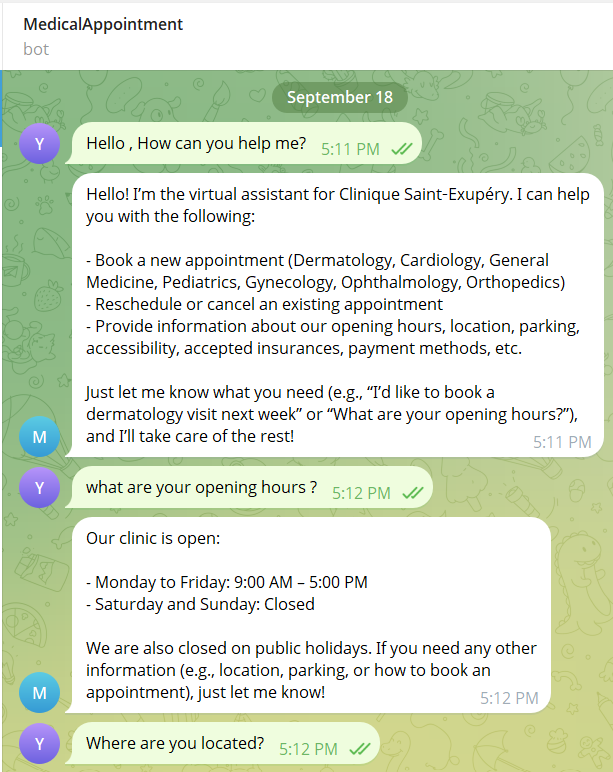 | 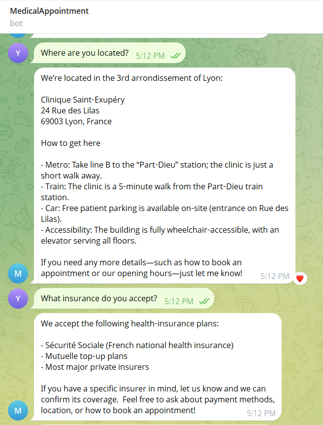 |
| 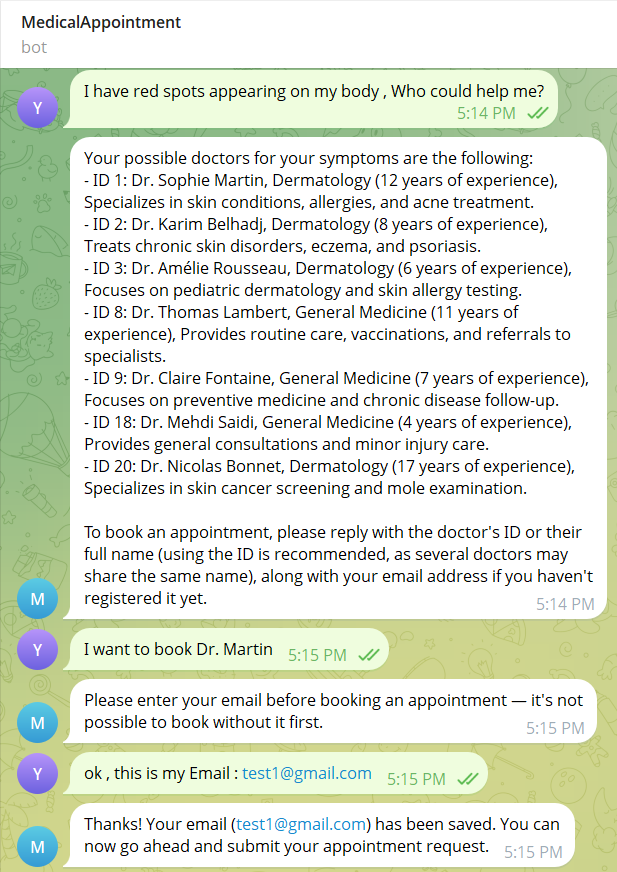 | 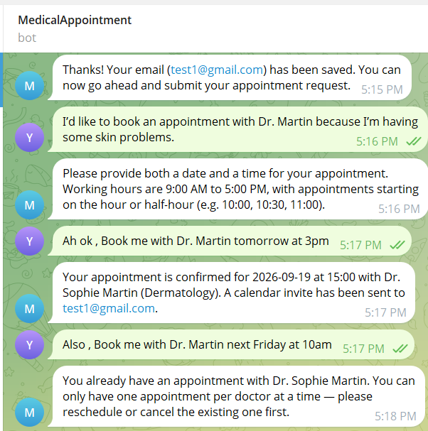 |
| 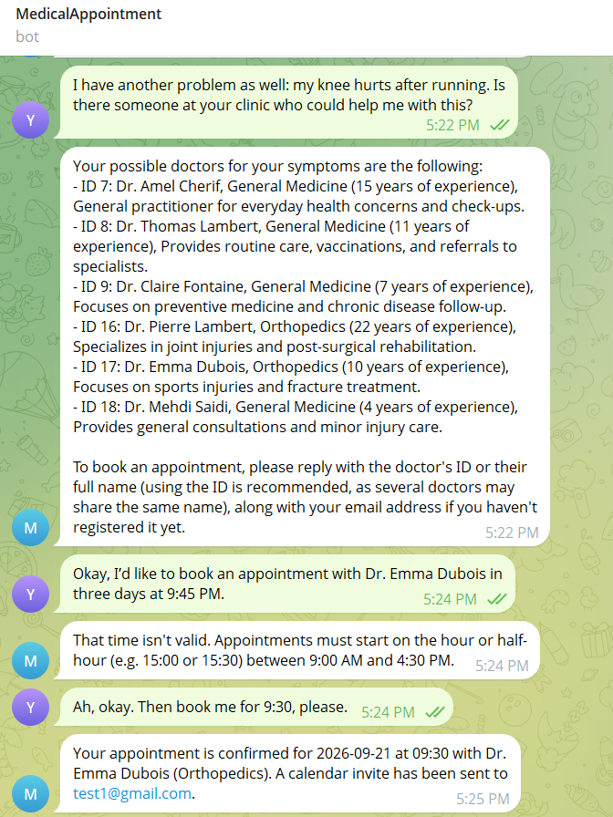 | 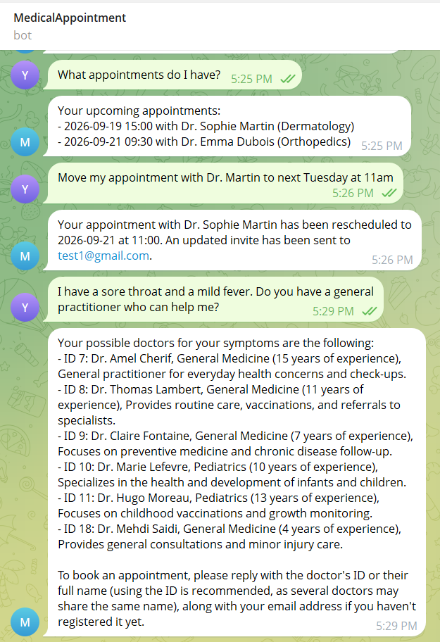 |
| 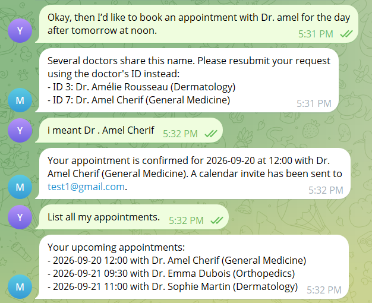 | |
 
### WhatsApp / Twilio (French conversation)
 
| | |
|---|---|
| 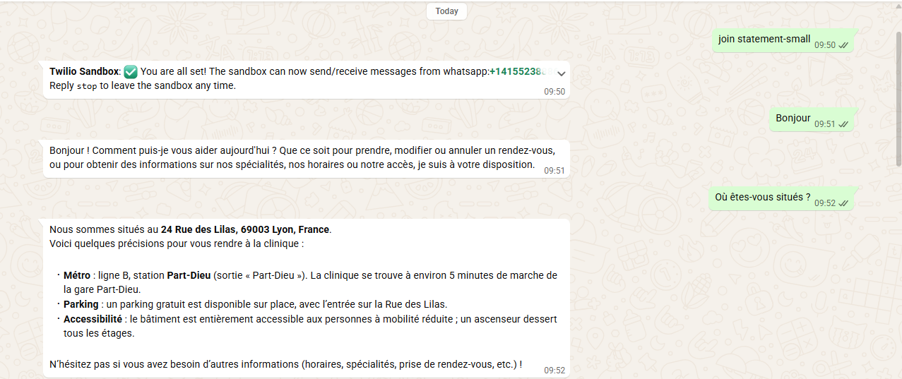 | 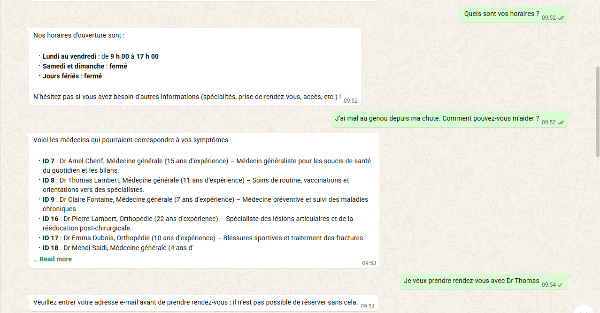 |
| 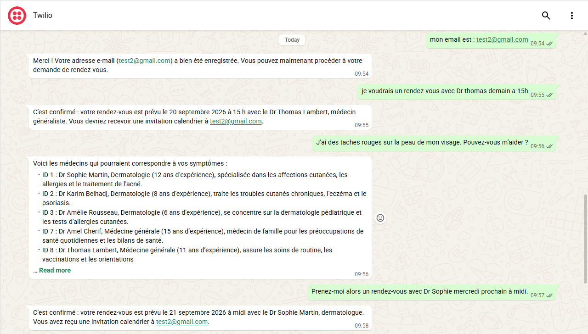 | 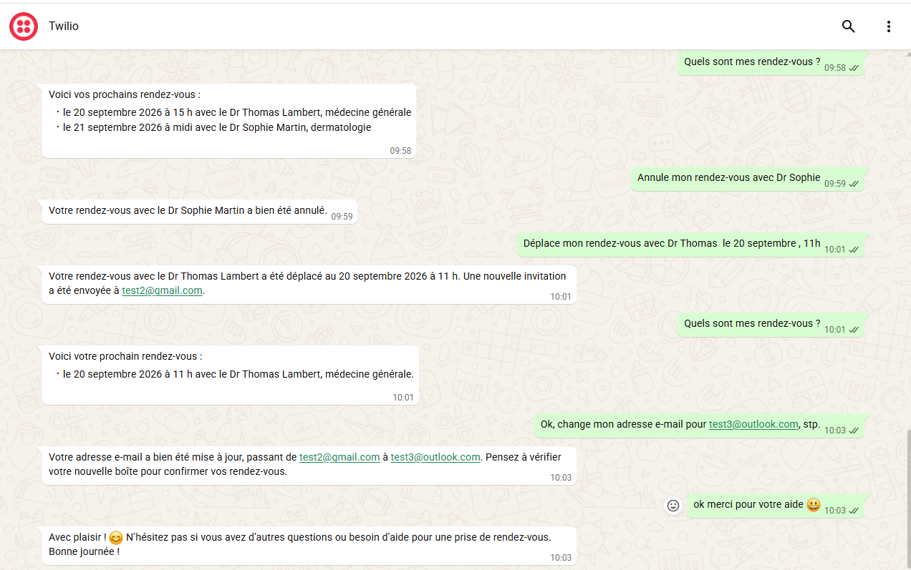


## How to Run the Project
 
### 1. Clone the repository
 
```bash
git clone https://github.com/yehyaabk/clinic-appointment-agent.git
cd clinic-appointment-agent
```
 
### 2. Install dependencies
 
```bash
uv sync
```
 
### 3. Set up environment variables
 
Copy `.env.example` to `.env` and fill in your own values:
 
```bash
cp .env.example .env
```
 
```env
DB_HOST=127.0.0.1
DB_PORT=3306
DB_USER=root
DB_PASSWORD=
DB_NAME=clinic_appointments_db
 
TELEGRAM_BOT_TOKEN=your_telegram_bot_token
GROQ_API_KEY=your_groq_api_key
GROQ_MODEL=openai/gpt-oss-120b
```
 
### 4. Add Google Calendar credentials
 
Place your OAuth `credentials.json` file inside `calendar_service/`. On first
run, a browser window will open asking you to authorize access, and a
`token.json` file will then be saved automatically for future runs.
 
### 5. Start MySQL
 
Make sure MySQL is running (e.g. via XAMPP's control panel).
 
### 6. Run the app
 
```bash
uv run bot_server.py
```
 
This will:
- Create the database and tables if they don't exist
- Seed the doctors table with initial data
- Trigger the Google OAuth consent screen (first run only)
- Start the Flask server
- Open an ngrok tunnel and print the public URL
- Automatically register the Telegram webhook
  
### 7. Register the WhatsApp webhook (Twilio)
 
Copy the printed ngrok URL and paste it, with `/webhook/twilio` appended, into
the Twilio Console under **WhatsApp Sandbox Settings > "When a message comes
in"**.
 
### 8. Start chatting
 
Message your Telegram bot, or send a WhatsApp message to your Twilio sandbox
number, to start booking appointments.
 